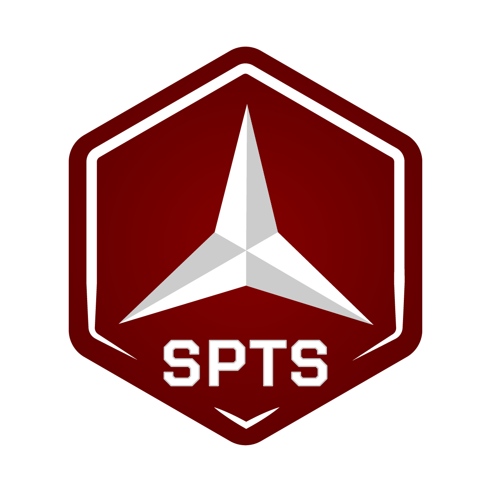

## Grupo Spartacus - Formulário de admissão


<div align="center">
  
</div>

### Sobre

Spartacus, é um clã formado em 2018 onde um dos pilares é a participação de todos os membros nas decisões do grupo, não temos cargos ou líderes permanentes. Nossa organização é feita em núcleos que gerem os assuntos de um ou mais jogos em particular. Leia o código que rege o clã no nosso <a href="dsc.gg/sptsbr">Discord</a>.

### Ajustes e melhorias

O projeto ainda está em desenvolvimento e as próximas atualizações serão voltadas para as seguintes tarefas:

- [x] Versão inicial com formulários funcionando.
- [ ] Linter de código
- [ ] Linter de commits
- [ ] Padronização de erros e logs
- [ ] Refatoração

### Desenvolvimento local

Para testar localmente:

```
npm run dev
npm run dev:server
```

### Contribuições

Para contribuir, siga estas etapas:

1. Bifurque este repositório.
2. Crie um branch: `git checkout -b <nome_branch>`.
3. Faça suas alterações e confirme-as: `git commit -m '<mensagem_commit>'`
4. Envie para o branch original: `git push origin <nome_do_projeto> / <local>`
5. Crie a solicitação de pull.
